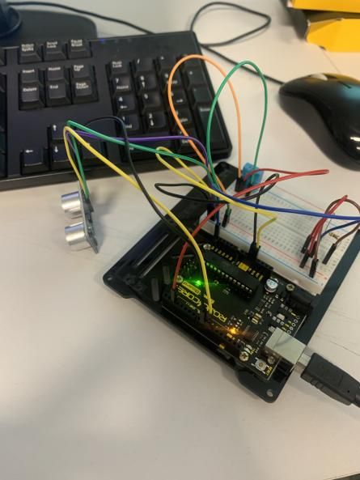
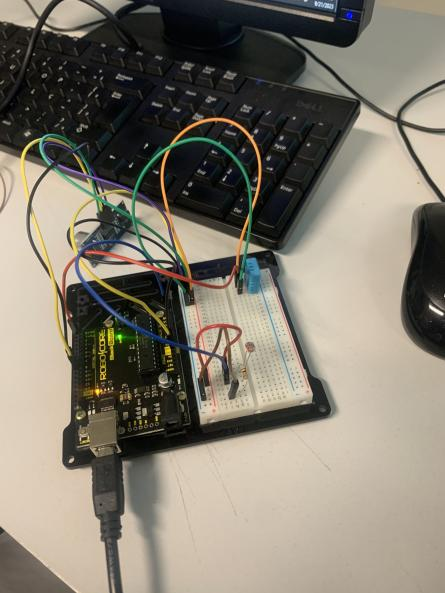
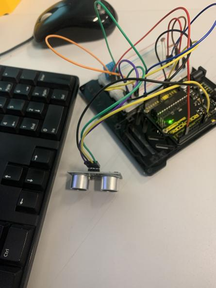
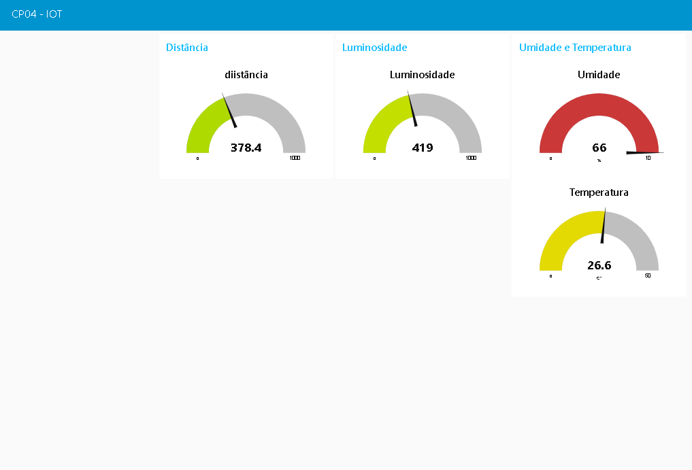
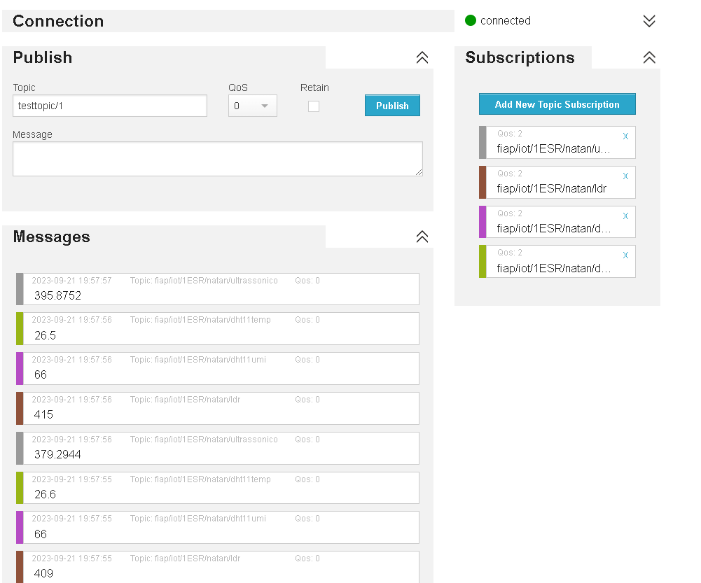
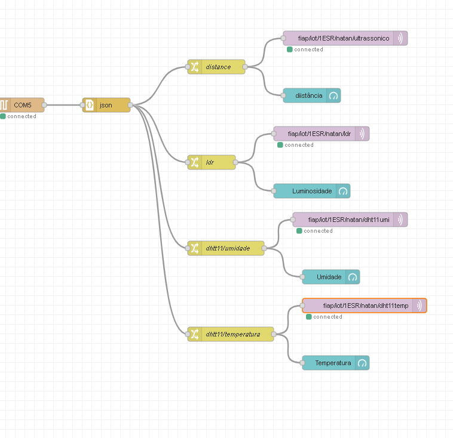

<h1 align="center">Checkpoint 04 - Edge</h1>
  
## :link: Links
* Github: https://github.com/Natan-TI/cp04-edge

## :memo: Descrição do projeto

* Checkpoint 04 - Edge Computing and Computer Systems
   
* Desafio: Utilizar 3 sensores no Arduino Uno R3, transformar os dados obtidos em JSON, passar os dados para o Node-Red, e do Node-Red para o MQTT. Ao final, fazer um dashboard com todos os dados que estão sendo recebidos.

## :books: Funcionalidades

* <b>Sensor de umidade</b>: Detecta a umidade.
   
* <b>Sensor de temperatura</b>: Detecta temperatura ambiente.
   
* <b>Sensor Ultrassônico</b>: Detecta distância.
   
* <b>Sensor LDR</b>: Detecta a luminosidade no local.
   
* <b>Dashboard</b>: Dashboard que mostra os dados dos sensores.

## :seedling: Instruções de uso

* Clonar repositório
   
* Colocar o código na IDE Arduino
   
* Fazer as devidas conexões dos sensores, fios e resistores no Arduino Uno R3
   
* Rodar o programa
   
* Adicionar o flow ao node-red
   
* Fazer a conexão ao node-red
   
* Adicionar os tópicos no HiveMQ

## :clipboard: Requisitos

* 1 Arduino Uno R3
   
* IDE Arduino
   
* 1 Sensor DHT11
   
* 1 Sensor Ultrassônico
   
* 1 Sensor LDR
   
* Node-red
   
* HiveMQ
   
* 1 Resistor de 10KΩ
   
* Ligação ao computador

## :hammer: Dependências
* Biblioteca ArduinoJson.h na IDE Arduino
   
* Biblioteca DHT sensor library na IDE Arduino
   
* Instalação do Node-red
   
* Biblioteca node-red-serial-port no node-red
   
* Biblioteca node-red-dashboard no node-red

## :wrench: Tecnologias utilizadas

* Arduino;
   
* C++;
   
* Display LDR;
   
* Sensor Ultrassônico;
   
* Sensor DHT11;
   
* Node.js;
   
* Node-red;
   
* HiveMQ;

## :handshake: Colaboradores
<table>
  <tr>
    <td align="center">
        
          <b>Enzo Luiz Goulart - RM99666</b>
           
        
        
          <b>Natan Eguchi dos Santos - RM98720</b>
           
        
        
          <b>Kayky Paschoal Ribeiro - RM99929</b>
           
        
        
          <b>Gustavo Henrique Santos Bonfim - RM98864</b>
           
        
        
          <b>Lucas Yuji Farias Umada - RM99757 </b>
           
        
    </td>
  </tr>
</table>

## :camera: Imagens
 
 
 
 
 
 

## :dart: Status do projeto
Concluido :white_check_mark: